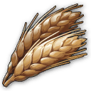
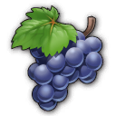
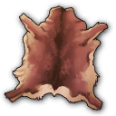
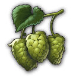

# Shared Anno 1800 Mods

Shared mods from Jakob's Collection.

## Include in your Mod

You are free to include ground textures and shared products, as long as you don't modify the mods themselves.

You may add additional unlocks, but please don't change balancing if that's not the core theme of your mod (e.g. complete rebalance mod is OK).

Easily add shared mods by adding the following URL pattern to the dependencies in `modinfo.json` with `ModID` as the name for the zip file:
```json
"ModDependencies": [
  "https://github.com/jakobharder/anno1800-shared-mods/releases/download/v4/cheese-jakob.zip"
]
```

## Products and Productions

Product mods contain product asset, icon, storage list, expedition values and Docklands information if applicable - at least a fake factory for `IsMainFactory` handling.

Production mods contain production buildings in one region and sometimes a chain menu with an unlock.

| | Name | GUID | Product | Production | Unlock
---|---|---|---|---|---
 | Vegetables | 1500010836 | `vegetables-jakob`| `ow-vegetables-jakob` | 1 
 | Flax | 114365 | vanilla | `ow-flax-jakob` | 1 
 | Olives | 1500010105 | `olives-jakob` | `ow-olive-oil-jakob`
| Olive Oil | 1500011326  | `olive-oil` | `ow-olive-oil-jakob`
 | Milk | 5385 | vanilla | `ow-cheese-jakob` | 1 
 | Cheese | 1500010102 | `cheese-jakob` | `ow-cheese-jakob`<br/>(`New World Cities`) | 1 
 | Hemp | 1440224 | `hemp-jakob` | `ow-hemp-jakob`<br/>(`New Horizons`, Asia)
 | Ropes | 1500010825 | `ropes-jakob` | `ow-ropes-jakob` | 500 
 | Tools | 1500010153 | `tools-jakob` | `ow-tools-jakob` | 900 
 | Sardines | 1500010120 | `sardines-jakob` | (`ow-sardines-jakob`) | 900 
 | Linen | 114391 | vanilla | `ow-linen-jakob`
 | Suits | 1500010127 | `suits-jakob` | (`ow-suits-jakob`) | 900 
 | Herbs | 5383 | vanilla | `ow-herbs-jakob`<br/>(`shared_herb_garden_kurila`)<br>*compatible, differ in fertility*
 | Tea | 1500010847 | `tea-jakob` | (`ow-tea-jakob`) | 900 

## Modular Decals

Contains 1x1 CFG tiles to use instead of decals.

- City: Engineer/Investor like pavements.
- Industry: Concrete/stone pavement for industries.

### Use Textures in your Mod

Add the following dependencies to your `modinfo.json`:
```json
"ModDependencies": [
  "https://github.com/jakobharder/anno1800-shared-mods/releases/download/v3.4/shared-ground-textures-city-jakob.zip",
  "https://github.com/jakobharder/anno1800-shared-mods/releases/download/v3.4/shared-ground-textures-industry-jakob.zip"
]
```

## Production Fertilities

Set | Hard | Medium | Easy
---|---|---|---
Any 1 |     |   |  
Any 2 |    |   |  *
Any 3 |     |   |  
Any 4 |    |   |  *
Any 5 |     |   |  
Any 6 |    |    |  
Non-starter 7 |     |   |  
Non-starter 8 |    |   |  
Non-starter 9 |    |    |  
Non-starter 10 |    |   |  
Non-starter 11 |    |   |  

*) Extra herb fertility on easy only with `ow-herbs-jakob`.
`shared_herb_garden_kurila` has the same on all difficulty levels, but comes with fertility items.

## Changes

### [Unreleased]

- Split products, productions into individual mods
- Added olive oil to olive related productions
- Added fertilities to vegetables, olives and hemp including existing save fallback with buffs

## How to Build

### Build with Visual Studio Code plugin

The mods are made with the [Modding Tools for Anno](https://marketplace.visualstudio.com/items?itemName=JakobHarder.anno-modding-tools) extension for [VS Code](https://code.visualstudio.com/).

Make sure to set `annoMods` settings.

Install the plugin, open a mod folder and press `F1` and choose `Build Anno Mod` or right click on a `modinfo.json` file.

### Build with Node.js

Run the following commands:

```
npm install .
npm run build
npm run package
```
