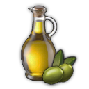

# Shared Anno 1800 Mods

<style>
  img.icon {
    vertical-align: text-bottom;
    width: 18px;
  }
</style>

Shared mods from Jakob's Collection.

You are free to include ground textures and shared products, as long as you don't modify the mods themselves.

You may add additional unlocks, but please don't change balancing if that's not the theme of your mod (e.g. rebalance together with vanilla rebalance is OK).

## Shared Products

ID: `shared-products-jakob`

Contains products with definition, icon and Docklands information.

Icon | GUID | Name | Region | Production Mod
---|---|---|---|---
 | 1500010836 | Vegetables | OW | `production-vegetables`
 | 1500010105 | Olives | OW | `production-olive-oil`
 | 1500011326 | Olive Oil | OW | `production-olive-oil`
 | vanilla | Milk | OW | `production-cheese`
 | 1500010102 | Cheese | OW<br/>(NW) | `production-cheese`<br/>(`New World Cities`)
 | 1500010153 | Tools | OW
 | 1500010120 | Sardines | OW<br/>NW
 | 1440224 | Hemp | OW<br/>(Asia) | `production-hemp`<br/>(`New Horizons`)
 | 1500010825 | Ropes
 | 1500010127 | Suits | OW | `production-suits`
 | vanilla | Herbs | OW
 | 1500010847 | Tea | OW

### Use Products in your Mod

Add the following dependencies to your `modinfo.json`:
```json
"ModDependencies": [
  "https://github.com/jakobharder/anno1800-shared-mods/releases/download/v3.5.1/shared-products-jakob.zip"
]
```

Products are not unlocked automatically, but with their production mods - mainly provided by `[Addon] Industrial Cities` and `[Addon] Pescatarians`.
You need to unlock them yourself, if you use the products without those.

## Ground Textures

Contains 1x1 CFG tiles to use instead of decals.

- City: Engineer/Investor like pavements.
- Industry: Concrete/stone pavement for industries.

### Use Textures in your Mod

Add the following dependencies to your `modinfo.json`:
```json
"ModDependencies": [
  "https://github.com/jakobharder/anno1800-shared-mods/releases/download/v3.4/shared-ground-textures-city-jakob.zip",
  "https://github.com/jakobharder/anno1800-shared-mods/releases/download/v3.4/shared-ground-textures-industry-jakob.zip"
]
```

## Production: Vegetables

ID: `production-vegetables`

Icon | GUID | Name | Unlock
---|---|---|---
 | 1500010836<br/>1500010830 | Vegetables<br/>Vegetable Farm | 400 

## Production: Olives and Olive Oil

ID: `production-olive-oil`

Contains products and production chains.
Soap is an alternative production chain to produce vanilla soap.

Icon | GUID | Name | Unlock | Chain
---|---|---|---|---
 | 1500010105<br/>1500010107 | Olives<br/>Olive Grove | 400 
 | 1500011326<br/>1500011325 | Olive Oil<br/>Olive Oil Press | 400 
 | TBD | Olive Soap Factory | 800  |  →  → 

## Production: Sardines

ID: `production-sardines`
Requires: `production-olive-oil`

Icon | GUID | Name | Unlock | Chain
---|---|---|---|---
 | 1500010120<br/>1500010121 | Sardines<br/>Fish Cannery | 800  |  →  +  +  → 

## Production: Hemp

ID: `production-hemp`

Icon | GUID | Name | Unlock
---|---|---|---
 | 1500010105<br/>1500010107 | Hemp<br/>Hemp Farm | 800 
 | vanilla<br/>1500011325 | Linen<br/>Linen Cloth Maker | 800 
 | 1500010825 | Ropes

## Production: Suits

ID: `production-suits`
Requires: `production-hemp`

Icon | GUID | Name | Unlock | Chain
---|---|---|---|---
 | 1500010127<br/>1500011150 | Suits<br/>Suits Factory | 800  |  →  → 

## Changes

### 3.5

- Added Tea to all drinks production

### 3.4

- Added more darken props in Ground Textures Industry
- Updated Korean translation

### 3.3

- Rebalanced unlocks
- Renamed canned fish to sardines

## How to Build

### Build with Visual Studio Code plugin

The mods are made with the [Modding Tools for Anno](https://marketplace.visualstudio.com/items?itemName=JakobHarder.anno-modding-tools) extension for [VS Code](https://code.visualstudio.com/).

Make sure to set `annoMods` settings.

Install the plugin, open a mod folder and press `F1` and choose `Build Anno Mod` or right click on a `modinfo.json` file.

### Build with Node.js

Run the following commands:

```
npm install .
npm run build
npm run package
```
