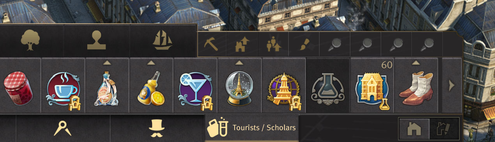

Automatically merge progression tier tabs when you run out of space.

## Use

This mod is meant to be used as a sub-mod in mods that add progression type construction menu tabs.

`Compact Menus` and `Industrial Cities` for example include it.

Merging is disabled when `spice_more_construction_tabs` is active.

## Tabs

The mod merges tabs until there are only 7 left

- Tourists + Scholars
- Farmers + Workers
- Engineers + Investors

Generally, the order is just the one tab after the other.
There are a few exceptions like streets that get pushed to the front to make the Farmer+Worker combination less awkward.

## Mark as Street

*Note: the system is the same as in `Compact Menus`, just with different tags.*

You need to add the tag `CompactStreet` to your street building / menu to be pushed to the front.

```xml
<ConstructionCategory>
  <BuildingList>
    ...
    <Item>
      <Building>123</Building>
      <CompactStreet />
    </Item>
    ...
  </BuildingList>
</ConstructionCategory>
```

The changes are applied with `LoadAfterIds: '*'`.
Avoid adding your building in that loading stage, otherwise contact me to add a dependency.
